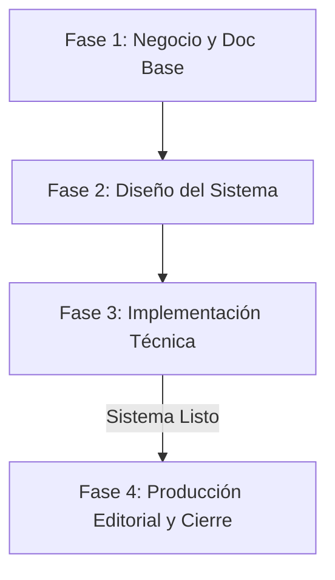

# 06 — Fases oficiales del proyecto

Este documento define la estructura de gobierno y avance del proyecto en 4 fases oficiales de trabajo.

---

## FASE 1 — Negocio y documentación base

*   **Objetivo:** Consolidar la identidad del taller, la opción activa de negocio y el inventario de fuentes documentales reales.
*   **Entregables:**
    *   Contrato de identidad (`docs_control/00_contrato_identidad_negocio.md`).
    *   Opción activa (`docs_control/01_opcion_activa_taller.md`).
    *   Inventario de fuentes y manifiesto de uso permitido.
*   **Criterios de cierre:**
    *   Gates 1 y 2 marcados como Completados en la gobernanza.
    *   Ningún documento de identidad contiene contradicciones de negocio.
*   **Qué NO se hace:** No se redacta contenido del plan de empresa ni respuestas finales, ni se define arquitectura de compilación técnica.

---

## FASE 2 — Diseño del sistema/repositorio

*   **Objetivo:** Definir la estructura física y lógica del repositorio, mapeo de sedes de información, límites de extensión y diseño de validaciones de calidad.
*   **Entregables:**
    *   Matriz de preguntas-fuentes-vacíos.
    *   Mapa maestro de fases y plantillas metodológicas.
    *   Definición de límites de extensión (`limites_extension_plan_empresa.yml`).
*   **Criterios de cierre:**
    *   Gates 3 y 4 marcados como Completados.
    *   Todos los vacíos de información identificados y asignados a decisiones pendientes.
*   **Qué NO se hace:** No se escribe código de scripts de compilación ni se redactan capítulos de negocio.

---

## FASE 3 — Implementación técnica del sistema

*   **Objetivo:** Construir los scripts de compilación y las herramientas de validación deterministas capaces de auditar y consolidar el plan.
*   **Entregables:**
    *   Scripts de compilación, linealidad, formato y texto corrupto usables y alineados.
    *   Dossiers consolidados puente de soporte.
    *   Entorno de ejecución reproducible (`uv`, `.venv`).
*   **Criterios de cierre:**
    *   Gates 5 y 6 marcados como Completados.
    *   Los scripts validadores devuelven PASS en las estructuras locales.
*   **Qué NO se hace:** **No se entrega el plan de empresa final.** Esta fase entrega el *sistema técnico capaz de producirlo*, pero no el consolidado editorial limpio.

---

## FASE 4 — Producción Editorial, Anexos y Cierre del Plan de Empresa

*   **Objetivo:** Realizar la producción editorial final, maquetación, control de extensión crítico, inserción de gráficos/tablas y exportación limpia para evaluación externa.
*   **Entregables:**
    *   Consolidado limpio del Plan de Empresa (` plan_empresa_taller_colaborativo_completo.md`).
    *   Exportación oficial a formatos finales (DOCX final, PDF final).
    *   Anexos, tablas, gráficos y portada finalizados.
    *   Reporte final de auditoría de linealidad y formato en PASS absoluto.
*   **Criterios de cierre:**
    *   Gate 7 marcado como Completado.
    *   Aprobación manual y firma de cierre de Alex.
*   **Qué NO se hace:** No se modifica la estrategia base del negocio ni se alteran las preguntas estructurantes del plan.

---

## Relación entre Fases

La salida de cada fase sirve como gate obligatorio para la siguiente. El plan final listo para evaluación externa solo puede producirse y cerrarse en la Fase 4.
